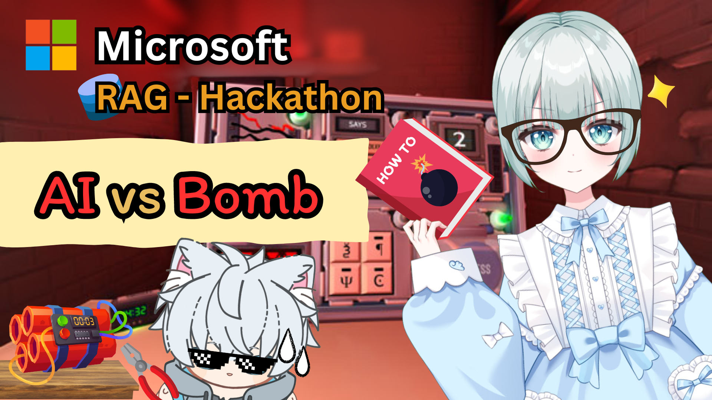
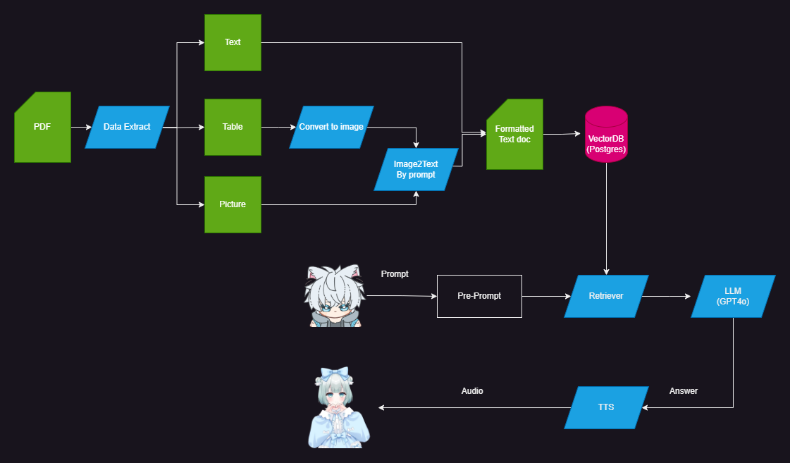

# AI-VS-BOMB

Crating AI to solve the bomb in game "Keep talking and no body explode"

Video: Show case
https://youtu.be/TzH6jbSjZPc

# Overview

This diagram illustrates the process to extract text, tables, and images data from PDF file, converts them into a simple format before put it to VectorDB (Postgres), so the retrieval can query with high accuracy before create & send final prompt to LLM model (GPT-4o), and provide the response via AI vtuber (Luna chan) as an audio output via Text-to-Speech (TTS).

**Note** Currently, Luna chan project is still private project, so we only provide the code for extracting data & RAG here

# Requirements
1) Docker
2) Conda
3) llm model in model/

# Get-Start
1) clone repo
2) install torch: https://pytorch.org/get-started/locally/
3) pip install -r requirements.txt

# Full-Tutorial by @lunaxoniichan
Summarize: https://www.youtube.com/watch?v=_K0lRd-4LpM&t=1s

How to Get-Start: https://www.youtube.com/live/z5kH4tCDgMA?si=yOyzSHH3MCXqaLge

# VectorDB (Postgres)
## How to use
1) docker-compose up -d
2) docker exec -it vector_store psql -U admin -d vector_store

## Commands
Show databases: 
> \d

# Chatbot UI
RUN
> chainlit run chatbot.py -w
